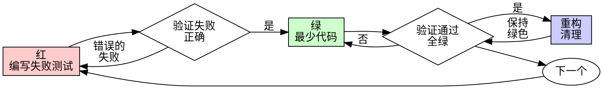

# 测试驱动开发 (TDD)

## 概述

TDD 是一种开发技术，你在编写足够的生产代码使测试通过之前，先编写一个失败的测试。

**核心原则：** 如果你没有看到测试失败，你就不知它是否在测试正确的东西。

**开始时声明：** “我正在使用 TDD 来 [任务名称]。”

## 红-绿-重构循环

### 1. 红：编写一个失败的测试
- 编写一个针对你想要实施的**单一**行为的测试。
- **看它失败。** 运行测试并确保它由于正确的原因（例如：断言失败，而不是语法错误）而失败。

### 2. 绿：编写通过测试的最少代码
- 编写**刚好足够**的代码使测试通过。不要过度设计。不要添加“以后可能需要”的功能。
- 运行所有测试并确保它们全部通过（全绿）。

### 3. 重构：清理代码
- 在保持测试通过的同时，提高代码质量。
- 消除重复，提高可读性，简化逻辑。
- 每次更改后运行测试。

## 规则

1. **先写测试：** 在看到失败的测试之前，不允许编写任何生产代码。
2. **小步快跑：** 每个循环应该只有几分钟长。
3. **只写必要的代码：** 仅编写使当前失败测试通过所需的生产代码。
4. **不要在红色状态下重构：** 只有在测试全部通过（绿色）时才进行重构。

## 常见错误

- **测试太庞大：** 一个测试试图测试太多的东西。将其分解。
- **跳过“看它失败”：** 如果你直接写了代码和测试，你不知道测试是否真的能捕捉到错误。
- **在重构阶段添加新功能：** 这会打破循环。先完成重构，然后再开始新的“红”阶段。

## 危险信号

**切勿：**
- 因为“这很简单”而跳过 TDD。
- 在测试失败时编写更多的生产代码。
- 忽略现有的测试失败。
- 提交没有对应测试的代码。
