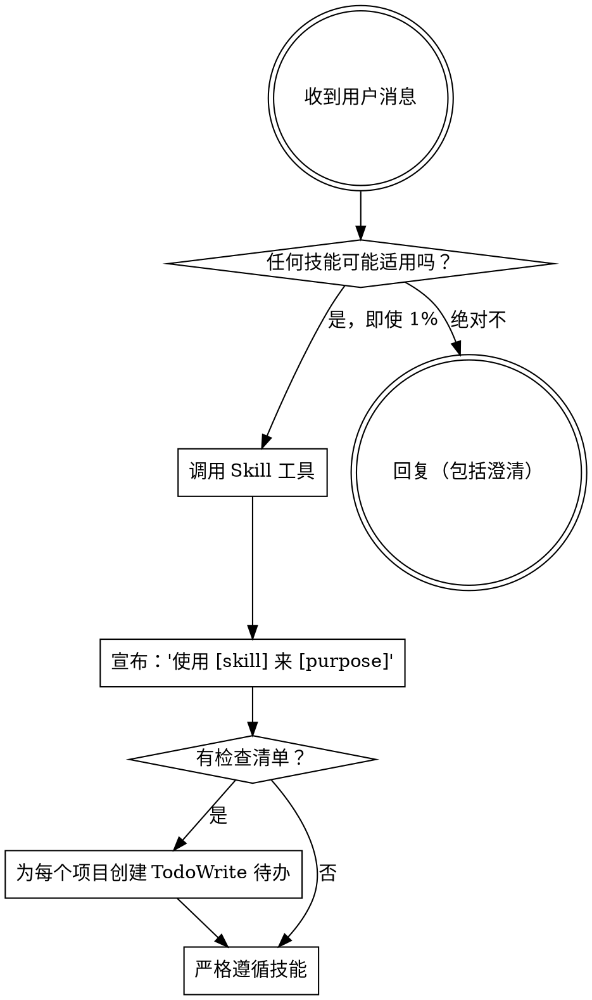

<EXTREMELY-IMPORTANT>
如果你认为有 1% 的机会技能可能适用于你正在做的事情，你绝对必须调用该技能。

如果技能适用于你的任务，你别无选择。你必须使用它。

这是不可谈判的。这不是可选的。你不能找借口不做这件事。
</EXTREMELY-IMPORTANT>

## 如何访问技能

**在 Trae/Claude Code 中：** 使用 `Skill` 工具。当你调用一个技能时，它的内容会被加载并呈现给你——直接遵循它。切勿对技能文件使用 Read 工具。

**在其他环境中：** 检查你的平台文档以了解如何加载技能。

# 使用技能

## 规则

**在任何回复或行动之前调用相关或请求的技能。** 即使技能有 1% 的机会可能适用，这意味着你应该调用技能进行检查。如果调用的技能对情况来说是错误的，你不必使用它。

## 危险信号

这些想法意味着停止——你正在找借口：

| 想法 | 现实 |
|---------|---------|
| “这只是一个简单的问题” | 问题即任务。检查技能。 |
| “我先需要更多上下文” | 技能检查在澄清问题**之前**。 |
| “让我先探索代码库” | 技能告诉你**如何**探索。先检查。 |
| “我可以快速检查 git/文件” | 文件缺乏对话上下文。检查技能。 |
| “让我先收集信息” | 技能告诉你**如何**收集信息。 |
| “这不需要正式技能” | 如果技能存在，使用它。 |
| “我记得这个技能” | 技能在进化。阅读当前版本。 |
| “这不算作任务” | 行动 = 任务。检查技能。 |
| “技能是大材小用” | 简单的事情会变得复杂。使用它。 |
| “我先做这一件事” | 在做任何事**之前**检查。 |
| “这感觉有效率” | 无纪律的行动浪费时间。技能防止这种情况。 |
| “我知道那意味着什么” | 知道概念 ≠ 使用技能。调用它。 |

## 技能优先级

当多个技能可能适用时，使用此顺序：

1. **流程技能优先**（头脑风暴、调试）- 这些决定**如何**处理任务
2. **实施技能其次**（前端设计、mcp 构建器）- 这些指导执行

“让我们构建 X” → 先头脑风暴，然后实施技能。
“修复此 Bug” → 先调试，然后领域特定技能。

## 技能类型

**刚性**（TDD、调试）：严格遵循。不要适应掉纪律。

**灵活**（模式）：使原则适应上下文。

技能本身会告诉你它是哪种。

## 用户指令

指令说**什么**，不是**如何**。“添加 X”或“修复 Y”不意味着跳过工作流程。
