# Web UI 截图审计报告

## 审计对象

- 页面入口：`android-app/web/index.html`
- 访问地址：`http://127.0.0.1:4173/index.html`
- 审计方式：本地静态服务 + Playwright 自动化截图 + 人工逐图复核
- 最新审计批次：
  - [capture_manifest.json](./capture_manifest.json)
  - [gallery.html](./gallery.html)
  - [audit-contact-sheet.png](./audit-contact-sheet.png)
  - [review-pass10/](./review-pass10/)

## 快速查看

- 联系图总览：[audit-contact-sheet.png](./audit-contact-sheet.png)
- 结构化证据：[capture_manifest.json](./capture_manifest.json)
- 最新截图目录：[review-pass10/](./review-pass10/)

## 技能使用说明

- 已按要求使用 `web-ui-screenshot-audit` 的工作方式完成整页截图、按钮点击、弹层捕获与证据沉淀。
- 你点名的 `qt-widget-ui-review`、`qt-ui-audit`、`qt-design-preview` 不在当前会话可用技能列表中，因此本次以等价的 Playwright 截图审计 + 本地 UI 设计复核替代完成。

## 本轮设计判断

你的判断是对的：`档案 / 学习报告 / 保存进度 / 排行榜` 这组亮暖卡片，比原先的黑色重面板更适合儿童向产品，也更符合这款游戏现在的年龄感知。

因此这轮没有把所有 UI 一刀切改亮，而是做了分层处理：

- 游戏主 HUD 继续保留深色半透明，保证和绿色场景之间有足够对比。
- 所有“给孩子读、看、点”的对话框统一切换到奶油白 + 暖金 + 草绿色按钮的亮暖卡片风。
- `档案` 页顶部关闭按钮改成更短的胶囊按钮，不再挤压标题区。

## 覆盖范围

本次最终复测共沉淀 48 个可复核状态，覆盖了以下流程：

- `00-11` 首屏引导、语言切换、层级切换、档案创建、进入游戏
- `12-20` 桌面端主界面、背包、合成、设置、高级设置及关闭回流
- `21-28` 保存进度、档案、学习报告、排行榜及关闭回流
- `29-39` 左移 / 右移 / 跳跃 / 攻击 / 钻石 / 互动 / 切换 / 触控合成等交互态
- `40-47` 移动端引导、移动端账号进入、移动端主界面、移动端设置

## 关键截图逐图复核

### 1. 首屏引导 `00-initial-view`

[查看原图](./review-pass10/00-initial-view.png)

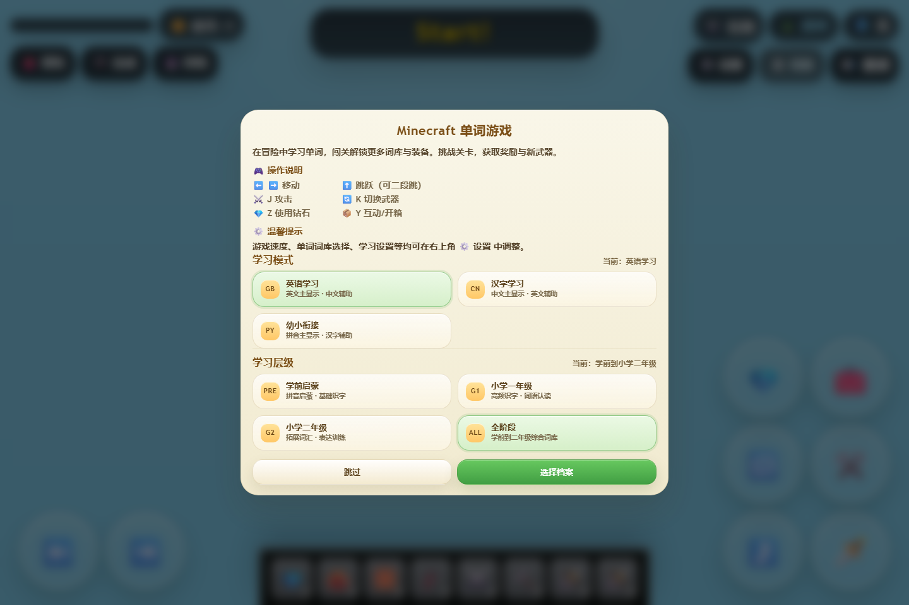

这张图是本轮最关键的方向验证。原先黑色卡片更像“工具弹窗”，现在的奶油白卡面、暖色标题和绿色 CTA 明显更贴近儿童向教育游戏。模式卡和层级卡已经和 `档案` 页建立起同一套视觉语言。剩余的小问题是操作说明仍然偏密，后续可以继续把键位说明做成更图标化的两段分组。

### 2. 背包 `13-inventory-modal`

[查看原图](./review-pass10/13-inventory-modal.png)

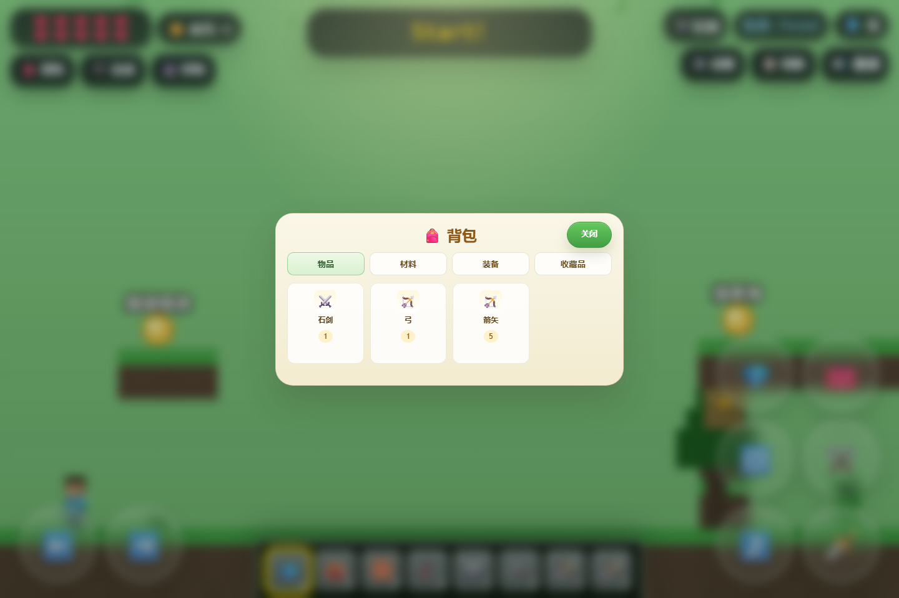

背包原来是纯黑弹窗，现在已经切到和档案页一致的亮暖卡片。标签、物品卡和顶部关闭按钮统一后，整体不再像另一套产品。作为儿童界面，这一版的识别负担更低，图标也更突出。

### 3. 合成台 `15-crafting-modal`

[查看原图](./review-pass10/15-crafting-modal.png)

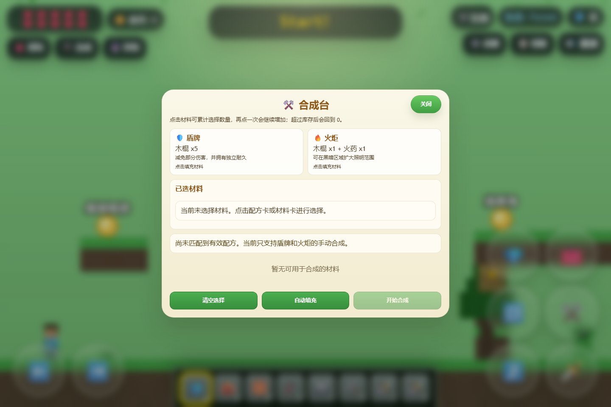

合成台和背包现在属于同一家族：顶部标题、说明区、选材区、底部按钮的层次清楚很多。相比旧版黑底，当前版本更像“卡片任务”，更适合小朋友理解“选材料 -> 看结果 -> 点击确认”的顺序。

### 4. 设置 `17-settings-modal`

[查看原图](./review-pass10/17-settings-modal.png)

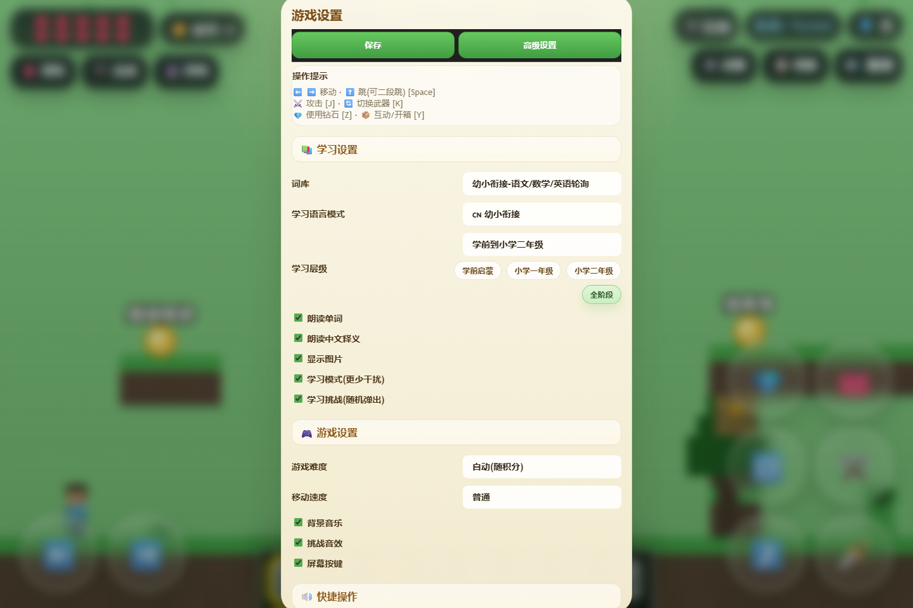

这里正好验证了你提的点。原来的黑色设置页在儿童场景里太压抑，现在已经改成亮暖大卡片，勾选项、分区标题、操作提示都更轻松。更重要的是，设置页终于和 `档案 / 保存进度 / 排行榜` 不是两个世界了。

### 5. 高级设置 `18-advanced-settings-modal`

[查看原图](./review-pass10/18-advanced-settings-modal.png)

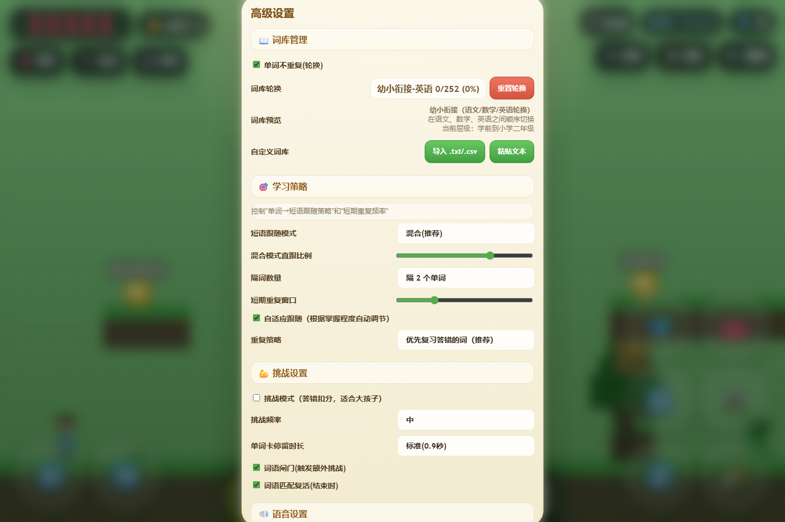

高级设置内容很多，完全做亮之后可读性和亲和力都比以前强。它仍然是信息密度最高的页面，但已经从“黑色参数面板”转成“长表单卡片”。如果后续要继续降低门槛，建议再做一层“基础 / 进阶”折叠分组。

### 6. 保存进度 `21-save-progress-modal`

[查看原图](./review-pass10/21-save-progress-modal.png)

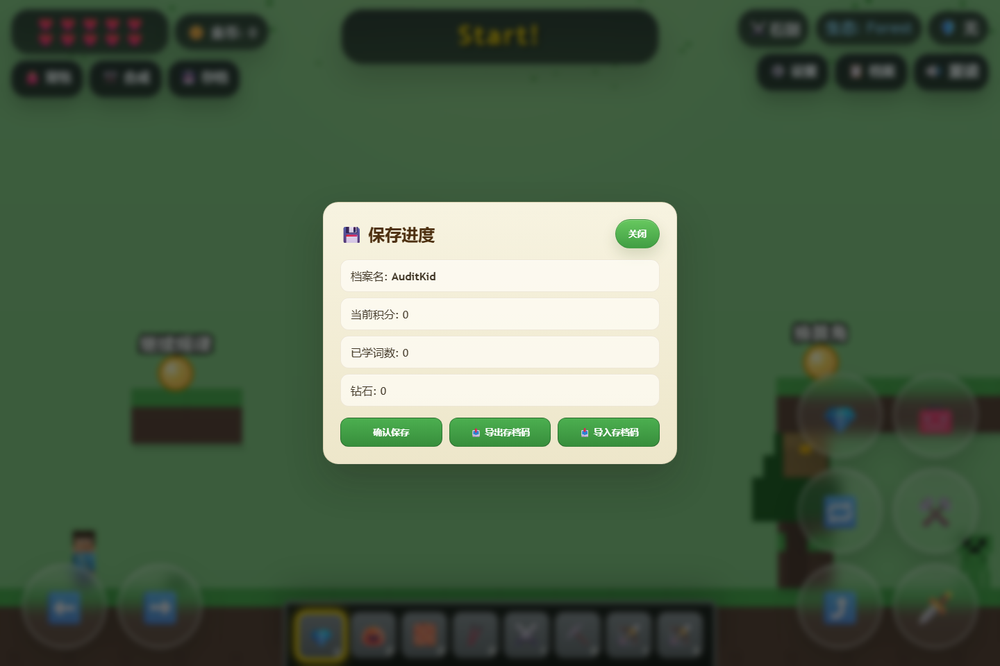

这张图本来就是更适合儿童向的参考样式，本轮没有推翻它，而是把别的对话框向它靠拢。现在它和背包、合成、设置终于是一套系统，而不是孤立的“亮色例外”。

### 7. 档案 `23-profile-modal`

[查看原图](./review-pass10/23-profile-modal.png)

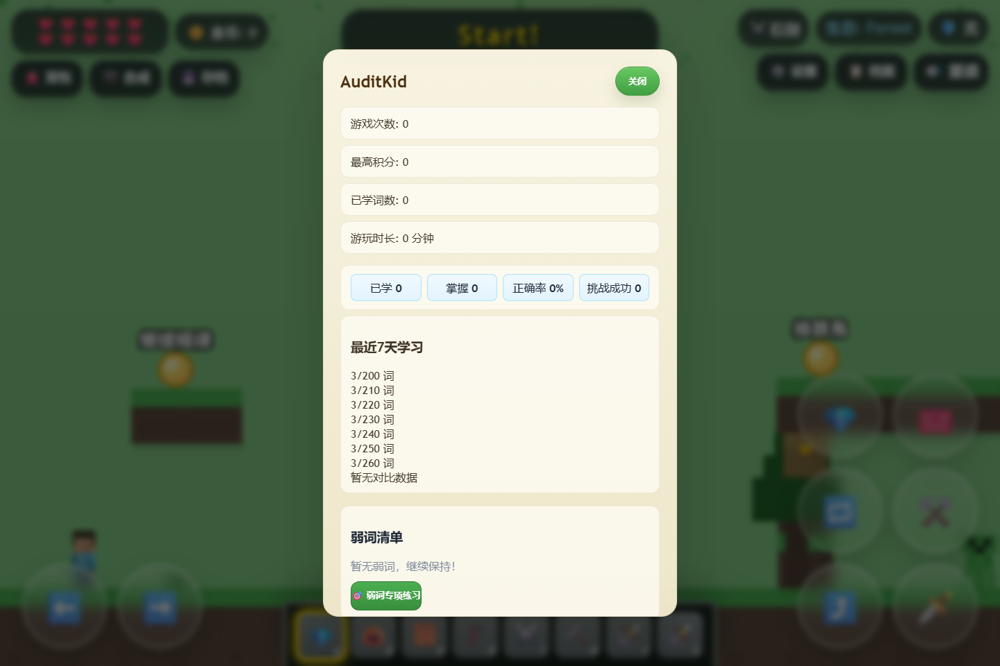

你指出的问题已经落地处理了：顶部关闭按钮从原先的长条按钮收紧成短胶囊，标题 `AuditKid` 不再被按钮压住。档案页依然是整套产品里最合适的视觉标杆，温和、干净、像儿童学习产品而不是设置中心。

### 8. 学习报告 `24-learning-report-modal`

[查看原图](./review-pass10/24-learning-report-modal.png)

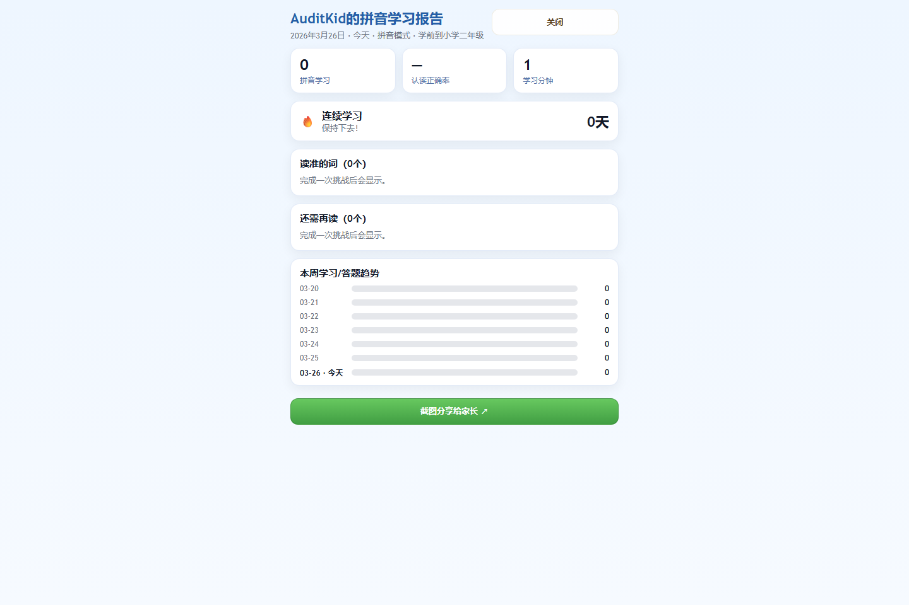

学习报告继续保持清爽白底，但底部分享 CTA 现在也切到了绿色，和全站的主按钮语言统一。它仍然是“家长报告风”，但不再突然出现一条很重的深黑按钮。

### 9. 排行榜 `27-leaderboard-modal`

[查看原图](./review-pass10/27-leaderboard-modal.png)

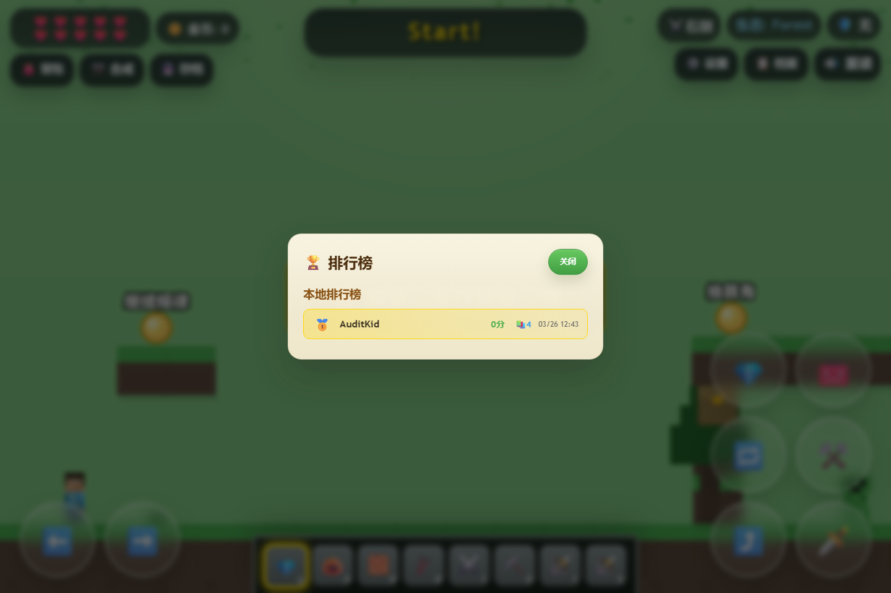

排行榜延续了档案页的亮暖风格，顶部关闭按钮也同步收紧。当前样式已经足够友好；如果后面继续做儿童奖励感，可以再加星星、奖牌光效或更强的前 3 名区分。

### 10. 移动端主界面 `45-mobile-gameplay-main`

[查看原图](./review-pass10/45-mobile-gameplay-main.png)

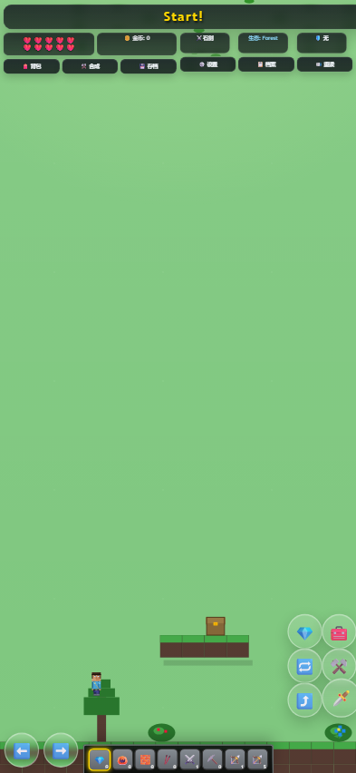

移动端主界面延续“深色 HUD + 亮色弹窗”的策略是合理的。顶部 HUD 仍然压得住场景，触控按钮没有过度放大，主视野保持了足够空间。这里不建议整页都改亮，否则 HUD 会和绿色背景打架。

### 11. 移动端设置 `46-mobile-settings-modal`

[查看原图](./review-pass10/46-mobile-settings-modal.png)

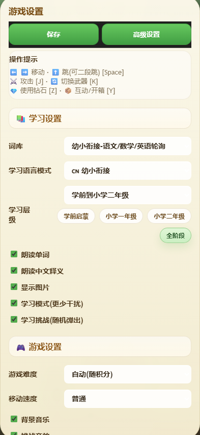

这张图说明亮暖风在手机上也成立。顶部按钮、分区标题、勾选项和层级 chip 的可读性已经足够。页面仍然较长，但“长”是信息量问题，不再是“黑压压看不下去”的问题。

## 本轮已落地优化

- 把 `开始提示框 / 设置 / 高级设置 / 背包 / 合成台` 从深黑面板统一切换到亮暖卡片风。
- 统一弹窗按钮语言：主操作使用绿色渐变按钮，次级操作使用浅底按钮。
- 收紧 `档案 / 排行榜 / 保存进度` 顶部关闭按钮，避免第一行按钮过长、抢标题。
- 把学习报告页的主 CTA 从深黑按钮改成绿色按钮，和整体儿童向风格保持一致。
- 修正设置页勾选项文案在亮底上的对比度问题，保证桌面和移动端都可读。

## 复测结果

- 最新批次：`review-pass10`
- Playwright 复测截图数：48
- 复测错误数：0
- 复测命令：`node android-app/web/audit/playwright-ui-audit.mjs`
- 已确认以下关键界面均已更新到最新亮暖风格：
  - 首屏引导
  - 背包 / 合成 / 设置 / 高级设置
  - 保存进度 / 档案 / 学习报告 / 排行榜
  - 移动端设置

## 仍可继续优化

- 首屏操作说明仍然略密，可以继续做成更大图标、更短句子的两段式说明。
- 高级设置建议后续加“基础 / 进阶”分层，避免一次把全部参数直接暴露给孩子。
- 如果后续继续强化儿童感，档案和排行榜可以加入更多插画化奖励元素，而不是只靠文字和统计卡片。

## 本次结论

这轮复测已经验证了你的判断：对儿童向产品来说，`档案` 这套亮暖风格确实比黑色重面板更合适。当前最合理的方案不是把整站都改亮，而是保留游戏 HUD 的深色对比，把所有对话框类 UI 统一到更温和、更明亮、更容易被小朋友接受的卡片体系中。现在这条视觉策略已经在 `review-pass10` 里落地并通过截图复测。

---

## HUD 第二轮专项复审（2026-03-26）

这轮是针对你新指出的 HUD 问题单独回炉：`太大 / 太挤 / 右侧超出屏幕 / 不够像真正的 HUD`。本轮只收 HUD，不再扰动已经统一好的亮暖弹窗体系。

### 联网调研结论

- [Apple HIG - Designing for games](https://developer.apple.com/design/human-interface-guidelines/designing-for-games) 明确强调三点：游戏文字必须始终清晰可读；按钮不能过小或过密；游戏内菜单和界面要用动态布局，避免固定布局遮挡内容。
- [Game Accessibility Guidelines - Provide high contrast between text/UI and background](https://gameaccessibilityguidelines.com/provide-high-contrast-between-text-ui-and-background/) 与 [If any subtitles / captions are used, present them in a clear, easy to read way](https://gameaccessibilityguidelines.com/if-any-subtitles-captions-are-used-present-them-in-a-clear-easy-to-read-way/) 都指向同一个方向：叠加在游戏画面上的信息层，应该依赖高对比、半透明底和简洁文本，而不是大面积高饱和色块。
- [Game Accessibility Guidelines - Ensure interactive elements / virtual controls are large and well spaced, particularly on small or touch screens](https://gameaccessibilityguidelines.com/ensure-interactive-elements-virtual-controls-are-large-and-well-spaced-particularly-on-small-or-touch-screens/) 说明触控元素需要足够可点，但同样强调“别挤在一起”。
- [UNICEF RITEC Design Toolbox](https://www.unicef.org/childrightsandbusiness/workstreams/responsible-technology/online-gaming/ritec-design-toolbox) 与 [RITEC Game Design Features & Children’s Well-Being Card Deck](https://www.unicef.org/childrightsandbusiness/reports/ritec-game-design-features-childrens-well-being-card-deck) 强调儿童游戏设计应优先考虑幸福感、清晰度、包容性与认知负担控制。

基于这些来源，可以明确推导出一个更适合当前产品的分层策略：

- 常驻 HUD：黑色半透明、低遮挡、短文本、弱存在感。
- 弹窗和引导：亮暖卡片、深色文字、明确按钮、情绪更友好。

也就是说，儿童向并不等于“所有界面都做亮色”。对于持续悬浮在游戏画面上的 HUD，深色半透明反而更利于孩子把注意力放回场景本身。

### 12. 桌面端主界面 HUD `12-gameplay-main`

[查看原图](./review-pass10/12-gameplay-main.png)

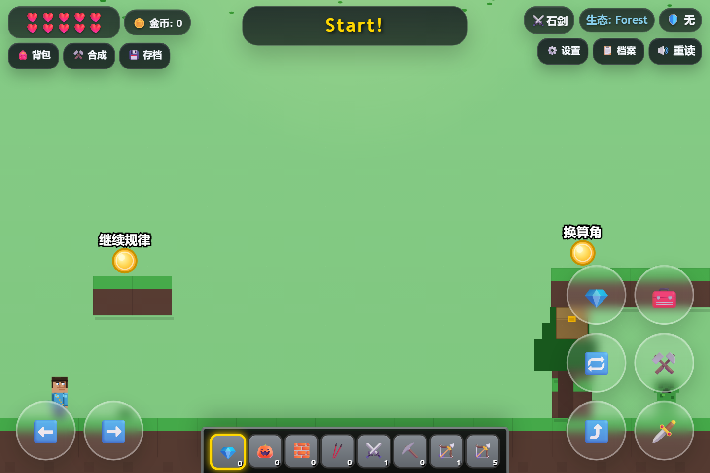

这张图说明核心问题已经被修正：

- 顶部左右两组信息被收回成真正的悬浮胶囊，不再像一整条压在天幕上的控制台。
- 右侧 `设置 / 档案 / 重读` 已经完全回到屏幕内，原先由 `width: 100% + padding` 造成的视觉溢出被消除。
- 左右按钮不再被 `flex: 1` 平均拉宽，所以每个按钮宽度更接近内容本身，呼吸感明显更好。
- 中间 `Start!` 仍然够醒目，但宽度和厚度都比上一版更克制，没有继续侵占主视野。

这版桌面 HUD 的风格已经和你的判断基本一致：更黑、更薄、更像游戏 HUD，而不是儿童设置条。

### 13. 移动端主界面 HUD `45-mobile-gameplay-main`

[查看原图](./review-pass10/45-mobile-gameplay-main.png)

移动端这轮也明显更顺了：

- 顶部信息层继续保持深色半透明，但每个块都更薄，屏幕上方留白更完整。
- 文字尺寸已经压下来了，不过仍然保持可辨识，没有因为追求紧凑而变成“看不清的小字”。
- 触控 HUD 和顶部状态 HUD 视觉上彻底分层，不会再有“上面一排很重、下面又一堆操作球”的双重压迫感。

移动端当前没有新的明显溢出问题。唯一保留意见是：如果后面打算适配年龄更低的孩子，可以在设置里加一个 `HUD 大小：标准 / 紧凑 / 大字` 选项，这会比强行把默认 HUD 做得很大更合理。

### 本轮已落地 HUD 优化

- 修复 `.hud-grid` 的宽度计算方式，解决右侧内容被 padding 顶出屏幕的问题。
- 去掉 HUD 子项的平均拉伸，让按钮与状态块按内容宽度自然收缩。
- 把顶部 HUD 从绿色重块改回黑色半透明悬浮胶囊，减少对游戏画面的干扰。
- 整体收紧 HUD 字号、内边距、圆角和阴影厚度，降低压迫感。
- 增加左右列对齐控制，并补上更合理的手机 / 平板断点。

### 专项复测结果

- 复测时间：`2026-03-26`
- 复测命令：`node android-app/web/audit/playwright-ui-audit.mjs`
- `capture_manifest.json` 记录截图数：`48`
- 复测错误数：`0`

### HUD 仍可继续优化

- 建议后续加入 `HUD 缩放档位`，满足不同年龄和不同设备的阅读偏好。
- 建议把 `生态: Forest`、武器、护甲这类信息逐步改成“图标优先 + 更短标签”，为英文或拼音模式预留更稳妥的长度空间。
- 建议给非关键状态加“静止时轻微降不透明度、交互时恢复”的机制，这会进一步减少常驻 HUD 对画面的占用。
