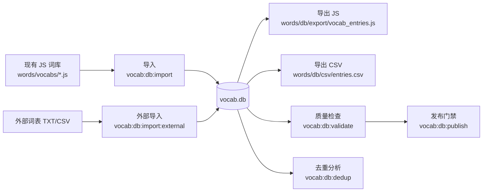

# 词库数据库维护图文指南（SQLite + CSV）

更新时间：2026-02-18

## 1. 总览图（架构）



## 2. 目录与产物

- 主库：`apk/words/db/vocab.db`
- 导入报告：`apk/words/db/reports/import-summary.json`
- 去重报告：`apk/words/db/reports/dedup-report.json`
- 外部导入报告：`apk/words/db/reports/external-import-*.json`
- 导出 JS：`apk/words/db/export/vocab_entries.js`
- 导出 CSV：`apk/words/db/csv/entries.csv`

## 3. 一次完整维护流程（实操命令）

在 `apk` 目录执行：

```bash
npm run vocab:db:import
npm run vocab:db:dedup
npm run vocab:db:import:external -- --url https://raw.githubusercontent.com/arstgit/high-frequency-vocabulary/master/10k.txt --sourcePack arstgit-10k --sourceGroup frequency --sourceVersion master --limit 500 --status inactive
npm run vocab:db:export
npm run vocab:db:validate
npm run vocab:db:publish
```

本次实测结果：

- `import`：45 个文件，9380 条原始词条导入成功。
- `dedup`：`exactDuplicateKeys=0`，`compactCollisions=453`，`multiSourceEntries=1886`。
- 外部词表（MIT 来源）导入 500 词：
  - 新增 `inserted=251`（均为 `inactive`）
  - 已存在激活词 `existedActive=25`
  - 已存在未激活词 `existedInactive=224`
- `export`：导出总词条 `3801`
- `validate`：激活词条 `2981`，重复键 `0`，缺失中文 `0`
- `publish`：通过

## 4. 去重维护（重点）

### 4.1 先看三类问题

- 精确重复：同 `lemma_key + learn_type`，会破坏一致性（当前为 0）。
- 多来源重叠：同词来自多个文件/包（用于追踪来源，不一定是错误）。
- 紧凑冲突：去空格/连字符后可能相同（如 `ice cream` vs `ice-cream`），需要人工判定。

### 4.2 去重处理建议

1. 先用 `dedup-report.json` 找候选冲突组。
2. 确认“保留词条”（通常保留中文更完整、来源更稳定的那条）。
3. 其余词条执行软删除：

```bash
npm run vocab:db:deactivate -- --word "<word>" --learnType word
```

4. 导出并复检：

```bash
npm run vocab:db:export
npm run vocab:db:validate
```

## 5. 外部词库合入（在线源）

### 5.1 推荐源（先许可证，再内容）

| 来源 | 链接 | 许可证 | 建议 |
|---|---|---|---|
| high-frequency-vocabulary | https://github.com/arstgit/high-frequency-vocabulary | MIT | 推荐，适合直接合入 |
| google-10000-english | https://github.com/first20hours/google-10000-english | 自定义限制（非标准开源） | 仅内部评估使用 |
| FrequencyWords | https://github.com/hermitdave/FrequencyWords | 代码 MIT，但词频内容 CC BY-SA 4.0 | 商用前务必做许可证评估 |
| CC-CEDICT | https://www.mdbg.net/chinese/dictionary?page=cc-cedict | CC BY-SA 4.0 | 可用于中英补充，但需满足署名/同许可 |

### 5.2 合入命令模板

```bash
npm run vocab:db:import:external -- --url <raw_txt_url> --sourcePack <source_id> --sourceGroup frequency --sourceVersion <tag_or_date> --limit 500 --status inactive
```

说明：

- 默认 `inactive`，不会影响线上激活词集合。
- 合入后先跑 `dedup + validate`，再人工激活。

## 6. 人工维护（增删改）

- 新增/更新：

```bash
npm run vocab:db:upsert -- --word apple --chinese 苹果 --difficulty easy --category fruit
```

- 软删除：

```bash
npm run vocab:db:deactivate -- --word apple --learnType word
```

## 7. 回滚与安全线

1. 回滚 DB：用 `apk/words/db/vocab.db` 的备份文件直接替换。
2. 回滚导出：重新执行 `npm run vocab:db:publish`。
3. 发布前最小检查：
   - `npm run vocab:db:dedup`
   - `npm run vocab:db:validate`
   - `npm run vocab:db:publish`

## 8. 每周维护清单

1. 跑一遍 `import -> dedup -> export -> validate`。
2. 检查 `compactCollisions` 是否持续上涨。
3. 对新增外部词条抽样补中文释义（优先高频词）。
4. 发布前固定执行 `vocab:db:publish`。
