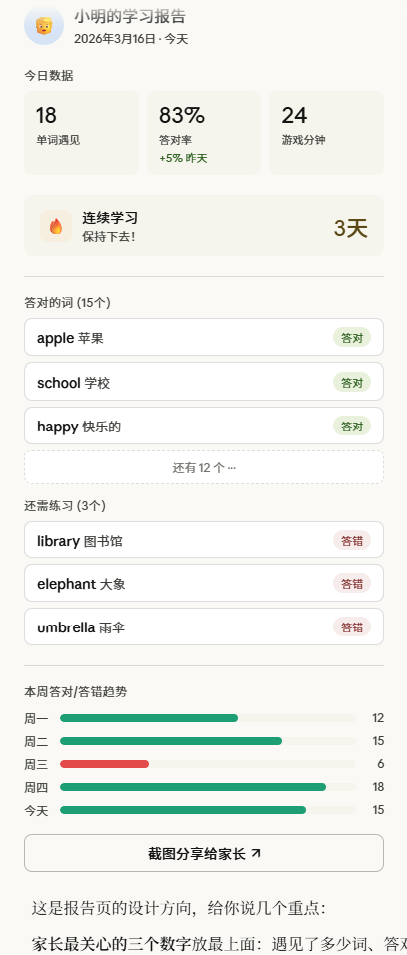

我倒是找了几个亲戚的孩子，或者我娃的朋友，有的还比较喜欢玩。但是家长的支持程度，只能说有的觉得好，有的没感觉

00:02

这个反馈其实很有价值，说明产品本身没问题，孩子愿意玩。

但你说的"家长有的觉得好，有的没感觉"——我想多了解一下，这样我能帮你判断问题出在哪。

有的看了，有的没看，但陪着玩的几乎没有，能陪一小会已经很难得

这个观察很关键，说明问题不在游戏本身，而在**家长感知不到学习效果**。

孩子玩得开心，但家长看不出"在学东西"，所以付钱的动力就不强。这是教育类游戏最常见的死穴。

------

## 真正的问题是这个

家长付钱的逻辑是：**我能看到孩子学了什么**。

你的游戏现在的样子，家长看过去感受到的是"又一个游戏"，而不是"学习工具"。不是你做得不好，是**学习效果没有被可视化**。

一个对比：

> 孩子玩了20分钟 → 家长问"学了什么？" → 孩子答不上来 → 家长觉得没用
>
> 孩子玩了20分钟 → 家长手机收到推送"今天学了15个单词，答对率80%" → 家长觉得值

------

## 所以比做变现系统更重要的一个改动

**加一个"今日学习报告"页面**，孩子玩完给家长看：

- 今天认识了哪些词（列出来）
- 答对了几次 / 答错了几次
- 连续学习天数

不需要后端，纯本地数据就行，你的存档系统已经有基础数据了。

这一个改动，能直接影响家长从"没感觉"变成"觉得有用"，**比做任何变现系统优先级都高**。

------

## 现在的建议顺序

**第一步**：加学习报告（1-2天，纯前端）→ 让家长能"看见"学习效果

**第二步**：发小红书，视频里专门展示报告页面给家长看

**第三步**：有人问怎么买，再谈变现

你觉得这个方向对吗？如果认可，我可以帮你设计报告页面的具体内容和样式。

好，情况清楚了。现有数据基础比较薄，但这反而是好事——**报告页和数据记录可以一起设计，不用迁就旧格式**。

我先给你设计报告页的样子，你确认方向对了，再给你写具体的数据记录代码。

这是报告页的设计方向，给你说几个重点：

**家长最关心的三个数字**放最上面：遇见了多少词、答对率、玩了多久。答对率比"已学词数"更直观，家长一眼就懂。

**"还需练习"这个区块是关键**，把答错的词单独列出来，家长会有动作——主动陪孩子复习这几个词。这是从"没感觉"到"觉得有用"的转折点。

**连续学习天数**是给孩子看的，激励他自己想来玩，减少家长催促的负担。

**"截图分享"按钮**是传播入口，家长晒娃学习打卡，小红书/朋友圈天然传播。

------

现在需要你确认一件事：游戏里答题的核心逻辑在哪个文件？是 `src/main.js` 还是其他地方？找到答题记录的位置，我直接帮你写存储这些数据的代码，插进去就能用。